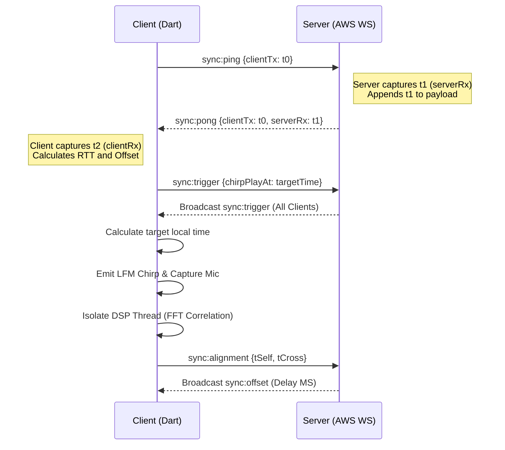

# AudioSync: Acoustically-Synchronized Collaborative Music Player

AudioSync is a distributed, high-precision playback synchronization engine achieving sub-5ms acoustic alignment and <500ms network consensus. Built on Dart, WebSockets, and FFT cross-correlation.

## 1. Deployment & Infrastructure (AWS & Docker)

Backend operates on AWS Virtual Machine, containerized via `docker-compose`. 

- **WebSocket Gateway**: Node.js backend container (`ghcr.io/theinfamoustheta/audio-sync-backend:latest`) exposes port `4000:4000`. 
- **State & Pub/Sub**: Redis 7 Alpine mapped to `6379:6379` handles cross-instance broadcast distribution. 
- **Media API**: `jiosaavn-api` built from source (`sumitkolhe/jiosaavn-api`) mapped to `3000:3000`. 
- **Storage**: SQLite volume `sqlite_data:/app/data` persists state.
- **Traffic Control**: IP-based HTTP rate limiting (100 req/min) and WebSocket handshake gating (5 upgrades/10sec) protect SQLite from exhaustion.

## 2. Network Architecture & Protocols

Production relies on AWS WebSocket backend for stable timeline consensus. 

*Active R&D Note (BLE P2P Fallback)*: Initial Bluetooth Low Energy mesh architecture built but pulled from production. Hardware fragmentation across BLE chips caused unpredictable latency spikes, destroying sub-5ms acoustic cross-correlation targets. AWS WebSocket proved strictly superior for stable timelines.

### Live Networked Sync

WAN timeline consensus utilizes an NTP-style UDP-over-WS mechanism. 

- **RTT Gating**: Maintains rolling 10-ping buffer. Rejects updates where RTT > 1.2x minimum RTT.
- **Warmup Phase**: Rapid convergence averaging `(_serverClockOffset * 0.5 + newOffset * 0.5)`.
- **Inertia Lock**: Active session uses 95% history retention: `(_serverClockOffset * 0.95 + newOffset * 0.05)`.

### Synchronization Sequence Diagram

## 3. Acoustic Synchronization Engine

### Isolate Concurrency
Heavy DSP workloads execute in separate memory spaces using Dart Isolates (`Isolate.run`), preventing UI thread frame drops. Passes `BackgroundDSPArgs` (Float32 templates and raw byte captures) across isolate boundaries.

### Background Noise Canceling (PNR Gate)
Pre-correlation normalization converts 16-bit PCM integer arrays to normalized Float32. Following FFT correlation, engine computes Peak-to-Noise Ratio (PNR). Requires `(globalMax / avgNoise) > 5.0` to prevent false positive locks on high ambient noise floors.

### 1st Wave Activation (Echo-Resilient)
Bypasses absolute global peak (frequently a loud room reflection). Establishes arrival threshold at `0.60 * globalMax`. Engine scans forward chronologically to find first local maxima crossing threshold, isolating true Line-of-Sight direct wavefront.

## 4. Third-Party Integrations: JioSaavn API

Leverages `sumitkolhe/jiosaavn-api` via local Docker conduit. Backend mounts `/api/v1/media` to route requests. Frontend receives normalized JSON payloads mapping to `MediaTrack` class. Serializes `trackId`, `audioStreamUrl`, `coverArtUrl`, and metadata. Playback directives (`playback:play`) broadcast `MediaTrack` state alongside server epoch start times (`playAt`).

## 5. Latency & Offset Mathematics

Algorithms extracted directly from DSP and network engines.

### Network Clock Synchronization
Client establishes timeline consensus using `t_0` (clientTx), `t_1` (serverRx), and `t_2` (clientRx).

$$ \text{RTT} = t_2 - t_0 $$

$$ \text{Offset}_{raw} = t_1 - \left( \frac{t_0 + t_2}{2} \right) $$

$$ \text{Offset}_{locked} = (\text{Offset}_{prev} \times 0.95) + (\text{Offset}_{raw} \times 0.05) $$

### Acoustic Cross-Correlation (FFT)
Converts spatial time-domain to frequency domain to execute sliding dot-product in $O(N \log N)$.

$$ X(f) = \mathcal{F}\{x_{mic}(t)\} $$
$$ Y(f) = \mathcal{F}\{y_{template}(t)\} $$
$$ R_{xy}(f) = X(f) \cdot \overline{Y(f)} $$
$$ r_{xy}(t) = \left| \mathcal{F}^{-1}\{R_{xy}(f)\} \right| $$

### 1st Wave Activation Threshold
Isolates true arrival time $t_{arrival}$ from room reflections.

$$ T_{arrival} = 0.60 \times \max(r_{xy}(t)) $$
$$ t_{arrival} = \min \{ t \mid r_{xy}(t) \geq T_{arrival} \text{ and } r_{xy}(t) \text{ is local maxima} \} $$

### Hardware Latency & Playback Offset
Final scheduled playback time relies on network consensus offset:

$$ \text{Target Local Time} = \text{playAt}_{server} - \text{Offset}_{locked} $$

$$ \text{Delay}_{compensation} = \text{Target Local Time} - \text{Date.now()} $$

## 6. Caching Engine

Predictive audio caching operates under strict memory constraints (200 MB maximum limit).
- **Eviction Policy**: Sweeps `/track_cache_*.mp3` files chronologically (oldest modified). 
- **Target Utilization**: Evicts files until total size reduces to 70% of maximum budget ($\le 140$ MB).
- Utilizes `touchFile()` access updates to maintain cache relevancy.

## 7. Debugging Matrix & Output Console

When compiled in `kDebugMode`, the Party Screen exposes a specialized **Debug Matrix & Output Console** for engineers.
- **Calibration Status**: Real-time display of alignment state (e.g., Lock status, raw ms delays).
- **System Output Console Logs**: A scrolling list of internal DSP and Network emissions with a quick-copy clipboard button.
- **Test Signal Generators (Host)**: Buttons to trigger artificial LFM pops (`SYNCED POP`, `NTP ONLY`, `NO NTP`) to isolate network vs acoustic sync logic.
- **Delay Injector**: A toggle to simulate a `+300ms` guest delay (`simulateGuestDelay300ms`). In testing, this guarantees the two test pops do not acoustically overlap, creating a clean temporal gap so the delta can be measured precisely.

## 8. Testing Methodology (Latency Verification)

To empirically verify the sub-5ms acoustic alignment claim, testing was conducted in a real-world environment using a three-device setup:
- **Device 1 & 2 (Android)**: Ran the AudioSync application.
- **Device 3 (iPhone)**: Acted as an external, high-fidelity measurement microphone. **Crucially, the iPhone was placed exactly equidistant between the two Android devices** to neutralize speed-of-sound propagation delays ($\approx 1\text{ms}$ per $34\text{cm}$).

### Debug & Calibration Setup
When the app is compiled and run in debug mode, a specialized **Debugging Section** becomes available in the Party Screen. This interface exposes raw sync variables and allows manual injection of artificial offsets. 
- **Artificial Skew**: A simulated `+300ms` delay was injected into one of the Android devices, while the other remained exactly on time. By separating the sounds, the microphone captures two distinct, non-overlapping spikes.
- **Test Signal**: Instead of playing a music track, the debugging suite triggers a sharp, rapidly decaying `2500Hz` LFM click/pop test sound on both devices simultaneously.

### Verification Script
The iPhone recorded the combined output of both Android devices in a normal acoustic room environment (preserving natural echoes and room reverb). 
1. The external audio capture was processed by an external Python script.
2. The script measured the true temporal $\Delta t$ between the two `2500Hz` audio spikes.
3. The effective sync latency was calculated using the absolute error formula:

$$ \text{Effective Latency} = \left| \Delta t_{measured} - 300\text{ms} \right| $$
